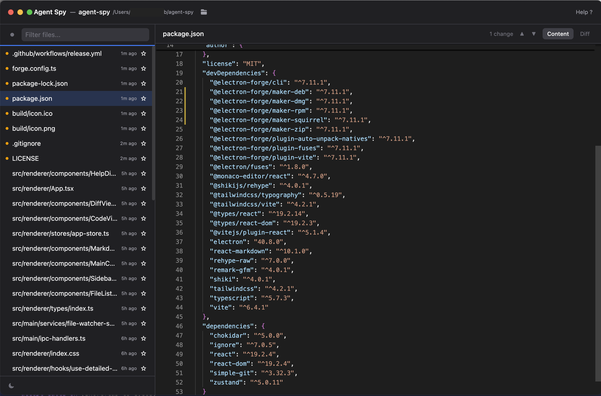

# Agent Spy

Your AI agent watchdog. Monitor and verify file changes made by AI agents in real time.



Agent Spy watches your project folder, highlights exactly what changed, and shows diffs against the last committed version. Stay in control of your codebase while AI agents work alongside you.

## Features

- **Live file watching** — see changes the moment they happen
- **Git change indicators** — yellow markers show which files differ from the last commit
- **Inline highlighting** — changed lines are highlighted in code and markdown (green for added, yellow for modified, red for deleted)
- **Side-by-side diff** — compare current file against the committed version
- **Change navigation** — step through changes one by one
- **Changed files filter** — focus on only the files that were modified
- **Star files** — pin important files to the top of the list

## Keyboard shortcuts

| Key     | Action                  |
| ------- | ----------------------- |
| `h`     | Focus file list         |
| `l`     | Focus file view         |
| `j`     | Next file / change      |
| `k`     | Previous file / change  |
| `s`     | Toggle star (file list) |
| `d`     | Toggle diff / content   |
| `/`     | Focus filter            |
| `c`     | Toggle changed filter   |
| `↑` `↓` | Scroll view             |
| `?`     | Toggle help             |

## Install

Download the latest release for your platform from [Releases](https://github.com/jank/agent-spy/releases).

> **Note:** This app is not code-signed. On macOS, you may see a warning that the application is damaged. To fix this, run:
>
> ```bash
> xattr -cr "/Applications/Agent Spy.app"
> ```

## Development

```bash
npx electron-forge start
```

## License

[MIT](LICENSE)
